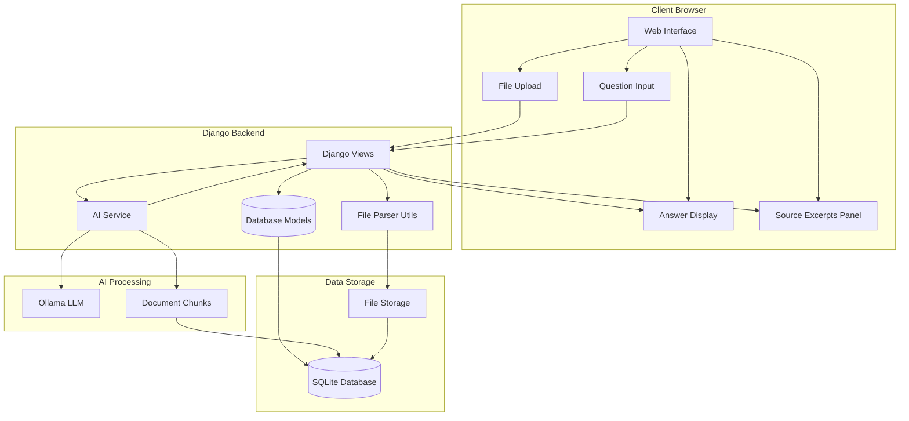
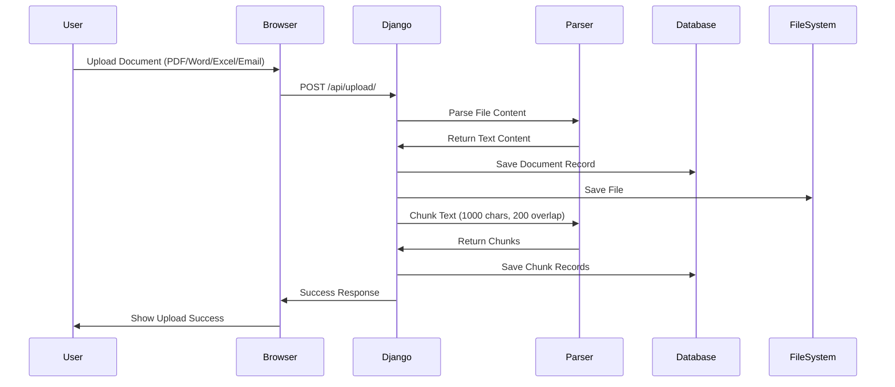
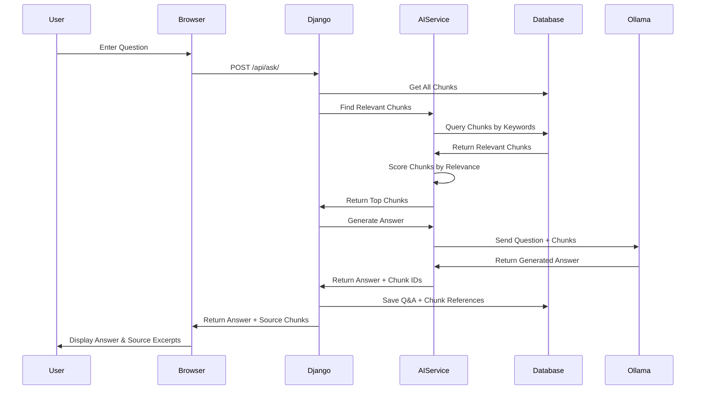
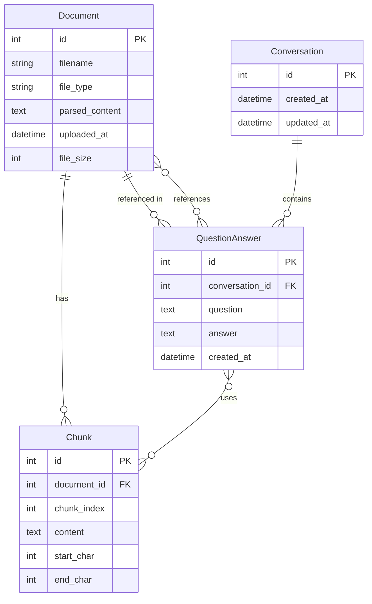

# Document Analyzer - Architecture Diagram

## System Architecture



## Document Upload Flow



## Question Answering Flow



## Data Model Relationships



## Component Details

### 1. File Upload & Processing
- **Input**: PDF, Word (.docx), Excel (.xlsx), Email (.eml, .msg)
- **Processing**: 
  - Extract text content
  - Split into chunks (1000 chars, 200 char overlap)
  - Store chunks with metadata
- **Output**: Document and Chunk records in database

### 2. Question Processing
- **Input**: User question
- **Processing**:
  - Find relevant chunks using keyword matching
  - Score chunks by relevance (keyword matches, phrase matches)
  - Select top 10 most relevant chunks
- **Output**: List of relevant chunks

### 3. Answer Generation
- **Input**: Question + Relevant Chunks
- **Processing**:
  - Build context from chunks
  - Send to Ollama LLM with focused prompt
  - Generate answer using only provided chunks
- **Output**: Answer + Source chunk IDs

### 4. Display
- **Left Panel**: Question and Answer
- **Right Panel**: Source excerpts (actual chunk text)
- **Features**: Click question to see source excerpts

## Technology Stack

```
┌─────────────────────────────────────────┐
│         Frontend (Browser)              │
│  - HTML/CSS/JavaScript (Vanilla)        │
│  - Drag & Drop File Upload              │
│  - AJAX API Calls                       │
└─────────────────────────────────────────┘
                    ↕ HTTP/REST API
┌─────────────────────────────────────────┐
│         Django Backend                  │
│  - Django 5.0.1                         │
│  - Django REST Framework                │
│  - SQLite Database                      │
│  - File Storage                         │
└─────────────────────────────────────────┘
                    ↕
┌─────────────────────────────────────────┐
│         File Processing                 │
│  - PyPDF2 (PDF parsing)                │
│  - python-docx (Word parsing)          │
│  - openpyxl (Excel parsing)            │
│  - Email parser (Email parsing)        │
│  - Text chunking utility                │
└─────────────────────────────────────────┘
                    ↕
┌─────────────────────────────────────────┐
│         AI Service                      │
│  - Ollama Python Client                 │
│  - Chunk Retrieval                      │
│  - Prompt Engineering                   │
│  - Answer Generation                    │
└─────────────────────────────────────────┘
                    ↕
┌─────────────────────────────────────────┐
│         Ollama LLM                      │
│  - Local LLM (llama3.2)                 │
│  - Runs on local machine                │
│  - No API keys needed                   │
│  - Privacy-focused                      │
└─────────────────────────────────────────┘
```

## Key Features

1. **Chunking System**: Documents split into manageable chunks for better retrieval
2. **Relevance Scoring**: Keyword and phrase matching to find most relevant chunks
3. **Source Attribution**: Shows exact text excerpts used to generate answers
4. **Focused Answers**: LLM instructed to use only provided chunks
5. **Multi-format Support**: Handles PDF, Word, Excel, and Email files
6. **Offline Processing**: All AI processing happens locally via Ollama

## Data Flow Summary

1. **Upload**: File → Parse → Chunk → Store
2. **Question**: Question → Find Chunks → Generate Answer → Display
3. **Display**: Answer + Source Chunks → User Interface

